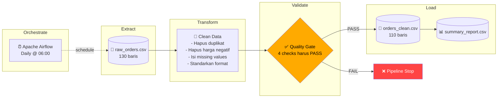
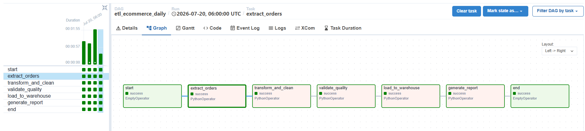
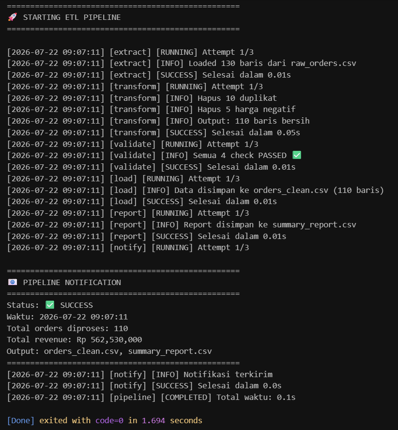

# 📦 End-to-End ETL Pipeline: E-Commerce Orders


Pipeline ETL end-to-end untuk memproses data transaksi e-commerce harian. Membersihkan data kotor dari berbagai channel penjualan, memvalidasi kualitas data, dan menghasilkan summary report — diorkestrasi menggunakan Apache Airflow.

---

## 🏗️ Architecture



---

## 🔍 Problem Statement

Data transaksi e-commerce dari 3 channel (website, marketplace, mobile app) memiliki berbagai masalah kualitas:

| Masalah | Jumlah | Dampak |
|---------|--------|--------|
| Baris duplikat | 10 | Revenue ter-inflate |
| Missing values | 25 | Query error, analisis bias |
| Harga negatif | 5 | Revenue calculation salah |
| Format tanggal inkonsisten | 130 | Time-series analysis gagal |
| Teks tidak standar | Banyak | Groupby menghasilkan grup palsu |

Pipeline ini menyelesaikan semua masalah di atas secara **otomatis dan terjadwal**.

---

## 📁 Project Structure

```
ProjectDE/
├── 📄 etl_pipeline.py          # Script ETL standalone (bisa dijalankan langsung)
├── 📄 orchestrator.py           # Mini orchestrator dengan retry + logging
├── 📂 dags/
│   └── 📄 etl_ecommerce_dag.py # Airflow DAG definition
├── 📂 data/
│   ├── 📄 raw_orders.csv        # Data mentah (input)
│   └── 📄 raw_products.csv      # Master data produk
├── 📄 orders_clean.csv          # Output: data bersih (110 baris)
├── 📄 summary_report.csv        # Output: summary per kategori
├── 📄 pipeline_log.txt          # Log eksekusi pipeline
├── 📄 etl_design.md             # Dokumen desain ETL
├── 📄 docker-compose.yaml       # Docker config untuk Airflow
└── 📄 README.md                 # File ini
```

---

## 🚀 Quick Start

### Option 1: Jalankan Script Langsung (Tanpa Airflow)

```bash
# Clone repository
git clone https://github.com/Imammudinn/ProjectDE.git
cd ProjectDE

# Install dependencies
pip install pandas numpy

# Jalankan ETL pipeline
python orchestrator.py
```

### Option 2: Jalankan dengan Airflow (Docker)

```bash
# Pastikan Docker Desktop sudah running
docker compose up -d

# Buka Airflow UI
# http://localhost:8080
# Login: admin / admin

# Cari DAG: etl_ecommerce_daily
# Toggle ON → Trigger DAG
```

---

## 🔧 Pipeline Steps

### Step 1: Extract
Membaca `raw_orders.csv` (130 baris, 11 kolom) dari sumber data.

### Step 2: Transform (6 substeps)
| # | Transformasi | Alasan |
|---|---|---|
| 1 | Hapus duplikasi | Menghindari inflasi order count dan revenue |
| 2 | Hapus harga negatif | Data error — tidak ada skenario bisnis valid |
| 3 | Isi missing values | Email → placeholder, harga → median |
| 4 | Standarkan tanggal | 4+ format berbeda → `datetime64` |
| 5 | Standarkan teks | SURABAYA/surabaya → Surabaya |
| 6 | Feature engineering | Tambah kolom `bulan` dan `kategori_harga` |

### Step 3: Validate (Quality Gate)
4 checks harus PASS sebelum data di-load:
- ✅ Zero duplicates
- ✅ Zero null values
- ✅ Zero negative prices
- ✅ Correct datetime type

**Jika validation gagal → pipeline STOP. Data kotor tidak masuk warehouse.**

### Step 4: Load
Output: `orders_clean.csv` (110 baris, 13 kolom) + `summary_report.csv`

---

## 📊 Sample Output

### Summary Report
| kategori | total_orders | total_revenue | avg_revenue |
|----------|--------------|---------------|-------------|
| Elektronik | 81 | 435,18 jt | 5,37 jt |
| Furniture | 29 | 127,35 jt | 4,39 jt |
| Total | 110 | 562,53 jt | - |


---

## 📸 Project Screenshots

### 1. Airflow DAG (Orchestration)
<!-- Ganti baris di bawah ini dengan gambar aslimu (hilangkan tanda komen <!- - dan - ->) -->
<!--  -->

### 2. Terminal Execution Log
<!-- Ganti baris di bawah ini dengan gambar aslimu -->
<!--  -->

### 3. Data Sebelum & Sesudah (Data Quality)
<!-- Ganti baris di bawah ini dengan gambar aslimu -->
<!--  -->

---

## ⚙️ Orchestration (Airflow)

```
DAG: etl_ecommerce_daily
Schedule: 0 6 * * * (setiap hari jam 06:00)
Retry: 2x dengan delay 1 menit

start >> extract >> transform >> validate >> load >> report >> end
```

### Error Handling
- **File tidak ditemukan** → `FileNotFoundError` → retry 2x
- **Validasi gagal** → Pipeline STOP (data kotor tidak di-load)
- **Task gagal** → Retry otomatis 2x → alert jika masih gagal

---

## 🛠️ Tech Stack

| Tool | Versi | Fungsi |
|------|-------|--------|
| Python | 3.11 | Bahasa pemrograman utama |
| Pandas | 2.x | Data manipulation & cleaning |
| NumPy | 1.x | Operasi numerik |
| Apache Airflow | 2.10 | Workflow orchestration |
| Docker | Compose v2 | Containerization |

---

## 📈 Next Steps (Roadmap)

- [ ] Migrasi output ke **Google BigQuery** sebagai data warehouse
- [ ] Tambahkan **Slack notification** saat pipeline gagal
- [ ] Buat **data quality dashboard** di Metabase
- [ ] Implementasi **Great Expectations** untuk testing lebih komprehensif
- [ ] Tambahkan **unit tests** untuk setiap task
- [ ] Setup **CI/CD** untuk DAG deployment

---

## 📄 Documentation

- [ETL Design Document](etl_design.md) — Penjelasan lengkap arsitektur dan keputusan desain
- [PPT Concept](ppt_concept.md) — Outline presentasi portfolio

---

## 👤 Author

**Muhammad Imam Mudin Baadali**
- Portfolio ini dibuat sebagai tugas final / project dari bootcamp **Dibimbing.id** untuk program Data Engineering.
- Tools: Python, Pandas, SQL, Apache Airflow (konsep)
